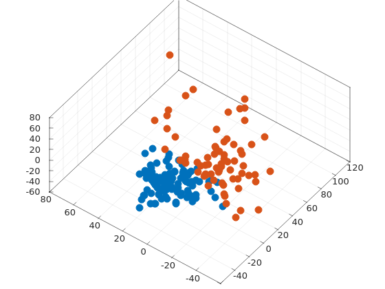

# cancer_analysis

Some code to reason about an ovarian cancer dataset.
The plan is to explore various clustering/classification algorithms, adding more as time goes on.
Below is what has been implemented so far

## Dataset
The dataset is comprised of 216 patients, 121 of whom have ovarian cancer and 95 of which who do not.
Each patient is associated with 4000 elements from a gene expression.

The dataset is stored on disk as two csv's; one containing the gene expression observations and the other containing the 'group' (i.e. cancer-having or healthy) each observation belongs to.
Preprocessing has been done on the 'group' file, transforming its original string representation into a numerical '1.0' for cancerous or '0.0' for healthy.

Before any analysis is performed (but after the data has been read from disk), the data is shuffled at random and partitioned into training (80%) and testing (20%) datasets.
Note at this time there is not a validation set (as the intial algorithms are all unsupervised), but one will be added at a later date.

## Preprocessing and Dimensionality Reduction
The first step taken is to scale the data to have a mean of zero and a standard deviation of 1.
Singular Value Decomposition (SVD) is then performed to find the Principle Components (based on the right singular vectors).
The first three singlular vectors (associated with the three largest singular values) are used to reduce the data's dimensionality.
At the end of this step, the training portion of the dataset is plotted (colored by group) using the three principle components as the x, y, and z axes, as shown below.

## K-Means
K-Means was implemented as the first algorithm with which to analyze the data.
It is an unsupervised technique, so the group labels are not used by the algorithm.

Performance of this algorithm was middling, as roughly 50 patients are put into the wrong cluster on the training set.
The cluster centers found from running the algorithm on the training set were used to 'predict' which group the patients in the test set belong to (based on which center was closer).
Results from the latter experiment were terrible, with the approach being little better than a coin flip.

These results appear to be repeatable, and have been tested under different random seeds and initial guesses (for the cluster centers).
An image of the training set clusters is shown below.

TODO: Take the cluster centers found when processing the training set and use them to predict which group the patients in the test set belong to.

## Acknowledgements
This dataset is sourced from the material provided with the book "Data Driven Science & Engineering: Machine Learning, Dynamical Systems, and Control" by S. L. Brunton and J. N. Kutz.

Initial experimentation (PCA) follows section 1.5 from the book, including inspiration from its code sample(s) (written in MATLAB and Python).
